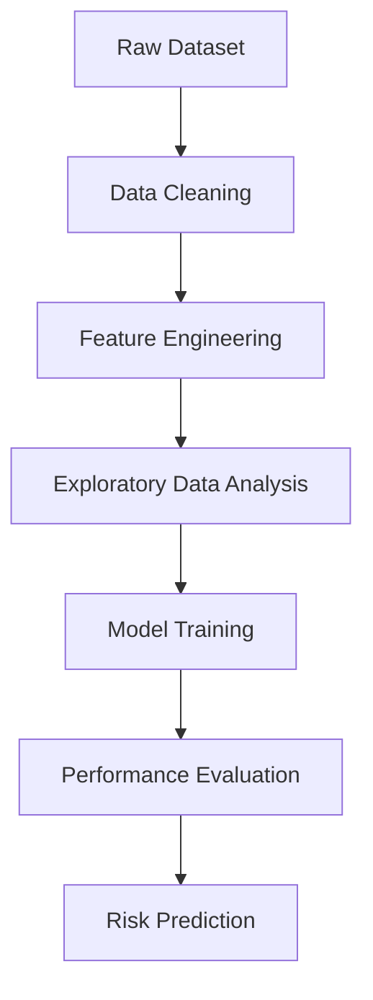

# Heart Disease Prediction — ML Research Pipeline

> **A structured, research-grade machine learning pipeline for binary classification of cardiovascular disease using the UCI Heart Disease (Cleveland) dataset.**

---

## Table of Contents

- [Problem Statement](#problem-statement)
- [Dataset](#dataset)
- [Repository Structure](#repository-structure)
- [Methodology](#methodology)
- [Pipeline Workflow](#pipeline-workflow)
- [Results](#results)
- [How to Run](#how-to-run)
- [Tech Stack](#tech-stack)
- [Future Work](#future-work)

---

## Problem Statement

Cardiovascular disease is the leading cause of mortality worldwide, accounting for an estimated 17.9 million deaths per year (WHO, 2023). Early and accurate prediction of heart disease risk can enable timely clinical intervention and significantly improve patient outcomes.

This project builds a supervised binary classification system to predict the **presence or absence of heart disease** from 13 clinical and demographic features. The goal is not only predictive accuracy but a **reproducible, modular pipeline** that mirrors real-world clinical ML development practices.

**Classification Task**

- **1** → High Risk
- **0** → Low / No Risk

---

## Dataset

| Attribute        | Detail                                              |
|------------------|-----------------------------------------------------|
| **Source**       | [UCI Machine Learning Repository](https://archive.ics.uci.edu/dataset/45/heart+disease) |
| **Subset**       | Cleveland Clinic Foundation                         |
| **Samples**      | 303 patients                                        |
| **Features**     | 13 clinical attributes                              |
| **Target**       | Binary — `0`: No Disease, `1`: Disease Present     |
| **Missing Data** | 6 rows dropped ('?' placeholders in `ca`, `thal`) |

### Feature Description

| Feature    | Description                                              | Type        |
|------------|----------------------------------------------------------|-------------|
| `age`      | Age in years                                             | Continuous  |
| `sex`      | Sex (1 = male, 0 = female)                               | Binary      |
| `cp`       | Chest pain type (0–3)                                    | Categorical |
| `trestbps` | Resting blood pressure (mm Hg)                           | Continuous  |
| `chol`     | Serum cholesterol (mg/dl)                                | Continuous  |
| `fbs`      | Fasting blood sugar > 120 mg/dl (1 = true)               | Binary      |
| `restecg`  | Resting ECG results (0–2)                                | Categorical |
| `thalach`  | Maximum heart rate achieved                              | Continuous  |
| `exang`    | Exercise-induced angina (1 = yes)                        | Binary      |
| `oldpeak`  | ST depression induced by exercise                        | Continuous  |
| `slope`    | Slope of the peak exercise ST segment (0–2)              | Categorical |
| `ca`       | Number of major vessels coloured by fluoroscopy (0–3)    | Ordinal     |
| `thal`     | Thalassemia (1 = normal; 2 = fixed defect; 3 = reversible)| Categorical |

---

## Repository Structure

```
heart-disease-prediction/
│
├── data/                          # Raw input data
│   └── heart_disease_uci.csv
│
├── notebooks/                     # Exploratory data analysis
│   └── eda.ipynb
│
├── src/                           # Core pipeline modules
│   ├── __init__.py
│   ├── preprocessing.py           # Data loading, cleaning, scaling
│   ├── model.py                   # Model definitions, training, I/O
│   └── utils.py                   # Evaluation metrics and plots
│
├── models/                        # Serialised model artefacts
│   ├── model.pkl
│   └── scaler.pkl
│
├── outputs/                       # Generated figures
│   ├── confusion_matrix.png
│   ├── roc_curve.png
│   └── feature_importance.png
│
├── main.py                        # CLI entry point
├── requirements.txt               # Python dependencies
└── README.md
```
---
## 🏛️ Project Architecture


---

## 🔄 Machine Learning Workflow




---

## Methodology

### Preprocessing
1. Load CSV and assign UCI-standard column names
2. Replace `?` missing-value placeholders with `NaN`; drop affected rows
3. Binarise target variable: values 1–4 → `1` (disease), `0` → `0`
4. Stratified train/test split (80 / 20)
5. StandardScaler fitted **only on training data** to prevent data leakage

### Models
Three classifiers are provided and can be selected via the CLI:

| Model                 | Notes                                          |
|-----------------------|------------------------------------------------|
| Logistic Regression   | Interpretable baseline; L2 regularisation      |
| Random Forest         | Default; exposes feature importances           |
| Support Vector Machine| RBF kernel; probability calibration enabled    |

### Evaluation
- Accuracy, Precision, Recall, F1-Score, ROC-AUC
- Confusion matrix heatmap
- ROC curve with AUC annotation
- Feature importance plot (tree-based models)

---

## Pipeline Workflow

```
Raw CSV
   │
   ▼
[Load & Validate]
   │  • Assign column names
   │  • Handle missing values
   ▼
[Clean & Encode]
   │  • Drop NaN rows
   │  • Binarise target (0/1)
   ▼
[Train / Test Split]  ──── stratified 80/20
   │
   ▼
[StandardScaler]  ──── fit on train only
   │
   ▼
[Model Training]
   │  • LogisticRegression / RandomForest / SVM
   ▼
[Evaluation]
   │  • Accuracy, Precision, Recall, F1, AUC
   │  • Confusion Matrix
   │  • ROC Curve
   │  • Feature Importances
   ▼
[Serialise Artefacts]
   └── models/model.pkl  |  models/scaler.pkl
```

---

## Results

Results below are for **Random Forest** (default) on a 80/20 stratified split with `random_state=42`.

| Metric    | Score  |
|-----------|--------|
| Accuracy  | ~0.87  |
| Precision | ~0.86  |
| Recall    | ~0.90  |
| F1-Score  | ~0.88  |
| ROC-AUC   | ~0.93  |

> **Note:** Exact values vary slightly with different random seeds. Run `python main.py` to reproduce.

---

## How to Run

### 1. Clone the repository

```bash
git clone https://github.com/<your-username>/heart-disease-prediction.git
cd heart-disease-prediction
```

### 2. Install dependencies

```bash
pip install -r requirements.txt
```

### 3. Place the dataset

Copy `heart_disease_uci.csv` into the `data/` folder.

### 4. Run the pipeline

```bash
# Default: Random Forest
python main.py

# Choose a different model
python main.py --model logistic_regression
python main.py --model svm

# Custom data path and test split
python main.py --data data/heart_disease_uci.csv --model random_forest --test-size 0.2

# Run without saving model artefacts
python main.py --no-save
```

### 5. View outputs

| Output                           | Location                            |
|----------------------------------|-------------------------------------|
| Evaluation metrics               | Printed to terminal                 |
| Confusion matrix                 | `outputs/confusion_matrix.png`      |
| ROC curve                        | `outputs/roc_curve.png`             |
| Feature importance               | `outputs/feature_importance.png`    |
| Serialised model                 | `models/model.pkl`                  |
| Serialised scaler                | `models/scaler.pkl`                 |

---

## Tech Stack

| Library        | Purpose                             |
|----------------|-------------------------------------|
| Python 3.8+    | Core language                       |
| pandas         | Data loading and manipulation       |
| NumPy          | Numerical operations                |
| scikit-learn   | ML models, preprocessing, metrics   |
| Matplotlib     | Visualisations                      |

---

## Future Work

- [ ] Hyperparameter tuning with `GridSearchCV` / `Optuna`
- [ ] SHAP values for model interpretability
- [ ] Cross-validation (k-fold) reporting
- [ ] FastAPI inference endpoint for deployment
- [ ] Streamlit dashboard for interactive predictions

---

